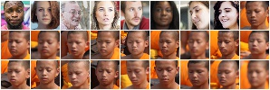

# face-collector

Collect faces from images and/or videos.

# Samples

## Collect faces from images

```
$ ./face-collector <images_dir>
```

6 photos in <images_dir>


faces collected from above photos



Sample photos taken from [Pictures Of People @ PEXELS](https://www.pexels.com/search/people/)

## Collect faces from video

```
$ ./face-collector capoiera_street_dance.mp4
```

List of the first 20 images of collected faces.


## Collect and rotate the face

Run with `--rotate` option, you can rotate face so that the two eys are horizontal.

```
$ ./face-collector capoiera_street_dance.mp4 --rotate
```

List of the first 20 images of collected faces


## Collect and expand face detection rectangle

Run with `--expansion` option, you can expand face detection rectangle by dlib based on interpupillary distance.

```
$ ./face-collector capoiera_street_dance.mp4 --expansion 2.0
```

List of the first 20 images of collected faces


## Collect faces from images and/or videos

Save images and/or videos in a directory. And run face-collector with the direcotry name.

```
$ ./face-collector <target_dir>
```

Sample video (capoiera_street_dance.mp4) taken from [Capoiera Street Dance @ PEXELS VIDEOS](https://videos.pexels.com/videos/capoiera-street-dance-1465)

## Collect faces from webcam

Run witn `--webcam <device-id>` option, you can collect faces from built-in camera or webcam.

```
$ ./face-collector --webcam 0
```

# Install requirements

- Python 2.7.x
- Dlib
- ffprobe including in ffmpeg (version >= 2.1)

# Installation

```
$ git clone https://github.com/knjcode/face-collector.git
$ cd face-collector
$ pip install -r requirements.txt
$ wget http://dlib.net/files/shape_predictor_68_face_landmarks.dat.bz2
$ bzip2 -d shape_predictor_68_face_landmarks.dat.bz2
$ wget http://dlib.net/files/mmod_human_face_detector.dat.bz2
$ bzip2 -d mmod_human_face_detector.dat.bz2
```

If you are using pyenv and you can not install dlib, try reinstalling python as in the following steps.

```
$ pyenv uninstall 2.7.13
$ env PYTHON_CONFIGURE_OPTS="--enable-shared" pyenv install 2.7.13
```

# Usage

Run face-collector with target (image or video or directory including images and/or videos).

```
$ ./face-collector.py <target_path>
```

Collected faces are saved in `faces` directory by default.

# Options

- `--output` (default `faces`)

  Set output directory

  ```
  $ ./face-collector.py <target_path> --output /path/to/output
  ```

- `--confidence` (default 0.6)

  Set a threshold for face detection confidence

  ```
  $ ./face-collector.py <target_path> --confidence 0.9
  ```

- `--resize`

  Specify the pixel dimensions of the face images.

  ```
  $ ./face-collecotr.py <target_path> --resize 64
  ```

- `--prefix` (default `face`)

  Specify the filename prefix

  ```
  $ ./face-collector.py foo.jpg --prefix sample
  image: foo.jpg
  Saved: faces/sample00000.png
  ```

- `--zerofill` (default 5)

  Specify the number of digits for zero-padding

  ```
  $ ./face-collector.py foo.jpg --zefofill 3
  image: foo.jpg
  Saved: faces/face000.png
  ```

- `--rotate` (default False)

  Rotate face so that the two eys are horizontal

- `--expansion` (default 1.5)

  Expand face detection frame by dlib based on interpupillary distance.

  ```
  $ ./face-collector.py <target_dir> --expansion 2.0
  ```

  expansion value must be at least 1.0

- `--frame-skip` (default 30)

  Specify frame skipping of video

  ```
  $ ./face-collector.py video.mp --frame-skip 30
  ```

  When 0 or 1 is specified, face detection is performed for all frames.

- `--webcam <device-id>`

  Collect faces from built-in camera or webcam

  ```
  $ ./face-collector.py --webcam 0
  ```

- `--imgcat`

  Display result image for iTerm2 (like a imgcat)

# License

MIT
